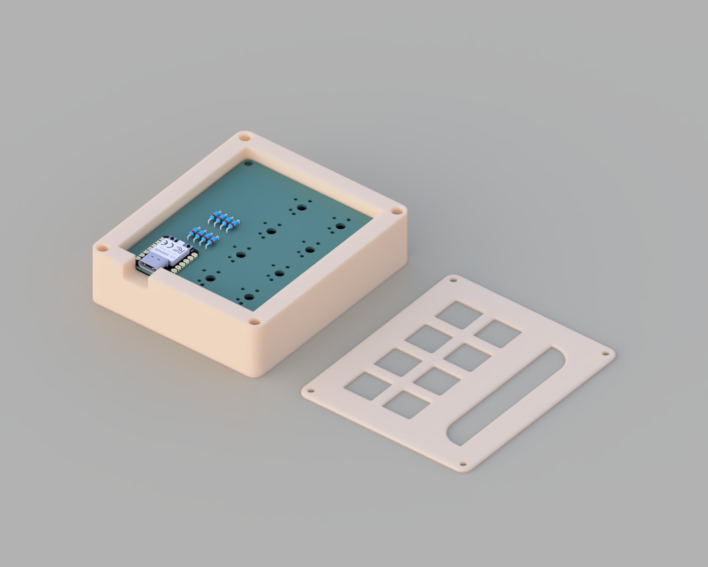

# SILAS' KEYPAD
Silas' hackpad project created with help from Hackclub! I plan to use this project as a numpad for blender 3d software. The keypad is a four by two grid and contains 2 status LEDs. The PCB was created in KICAD and the cad models were created in Fusion.

## Bill of Materials
- **8x** M3x5mx4mm heatset inserts
- **8x** M3x16mm screws
- **2x** SK6812 MINI-E LEDs
- **8x** Cherry MX Switches (Or equivilant)
- **8x** Blank DSA keycaps
- **8x** Through-hole 1N4148 Diodes
- 3d Printed Case & PCB
