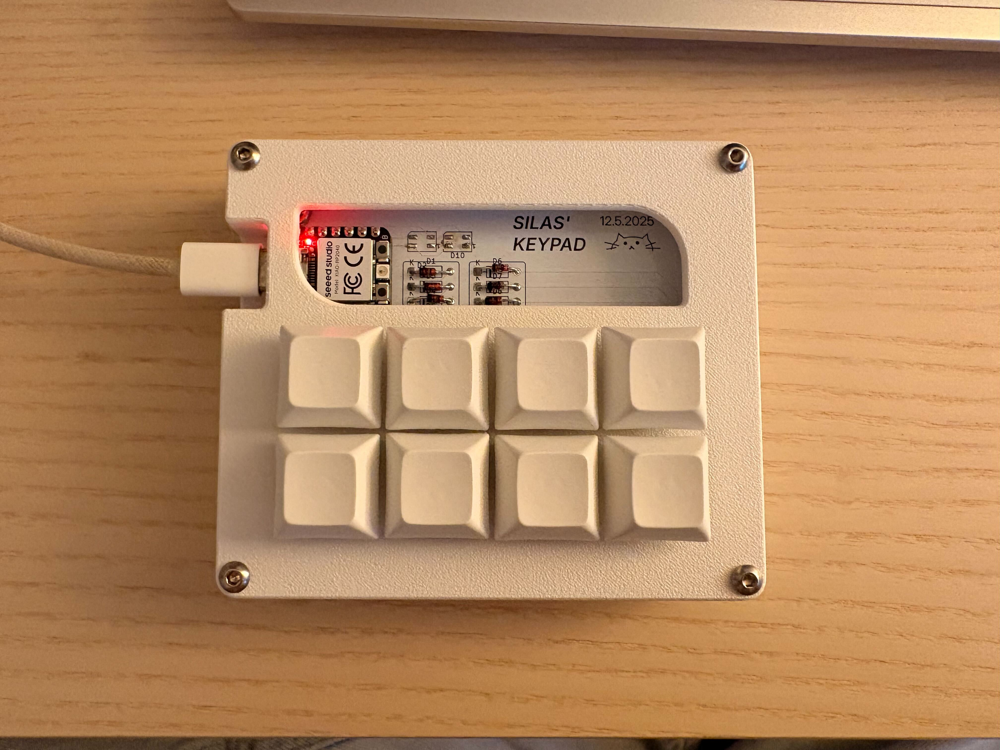
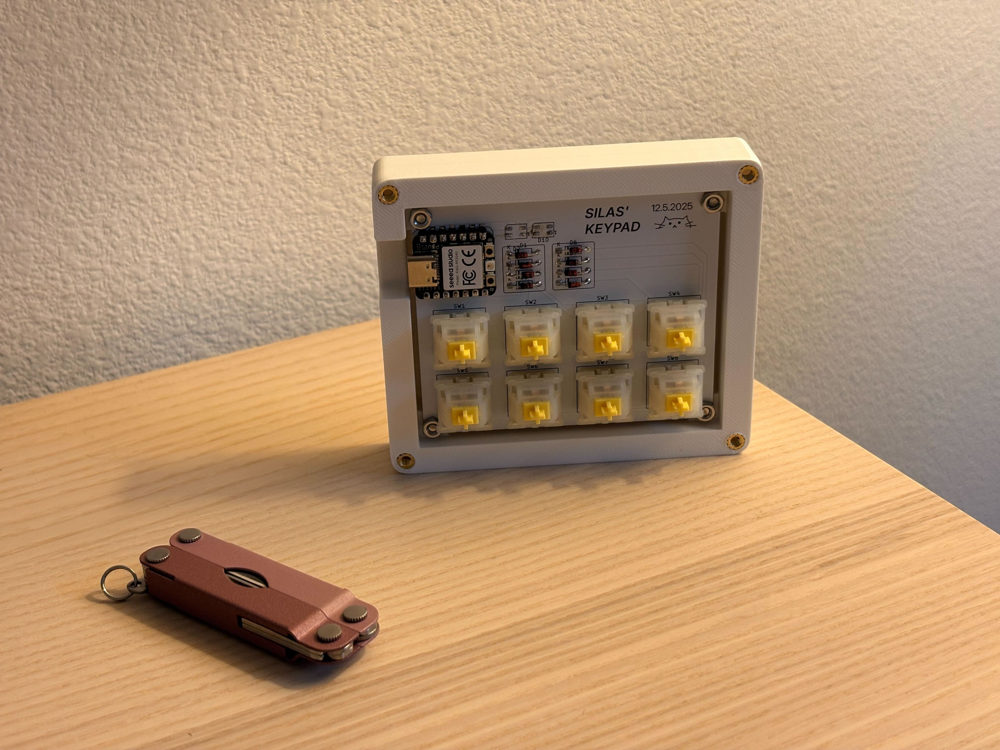
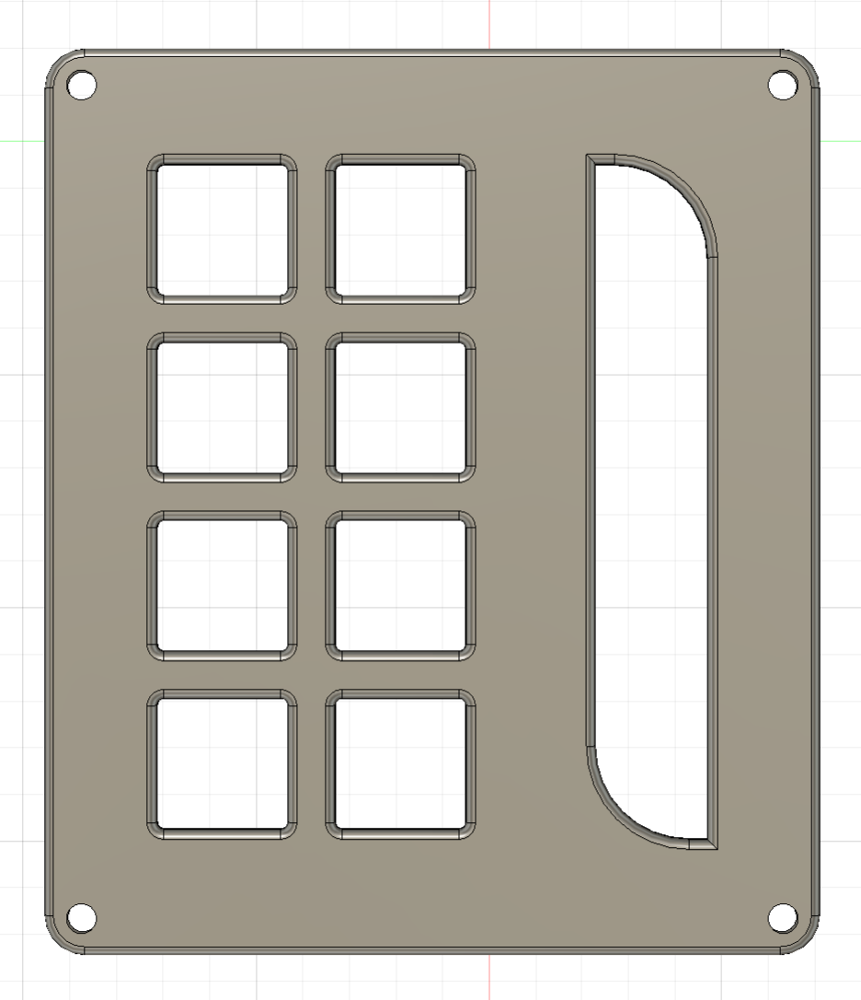
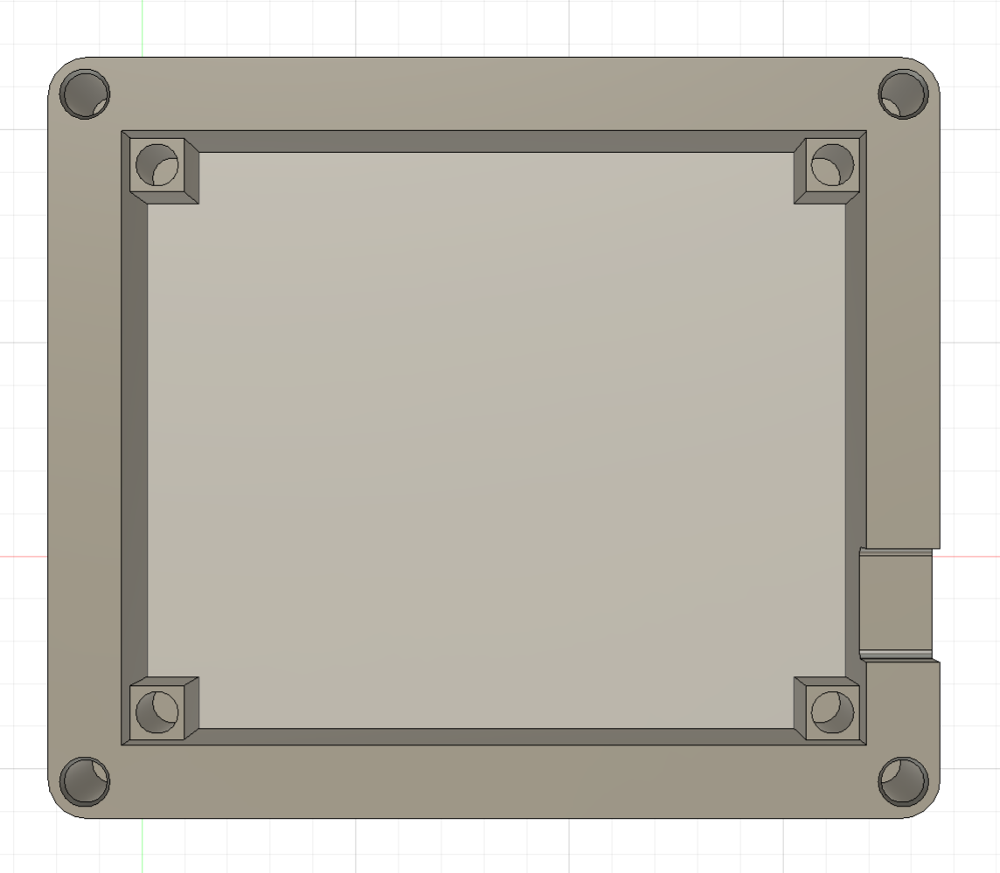
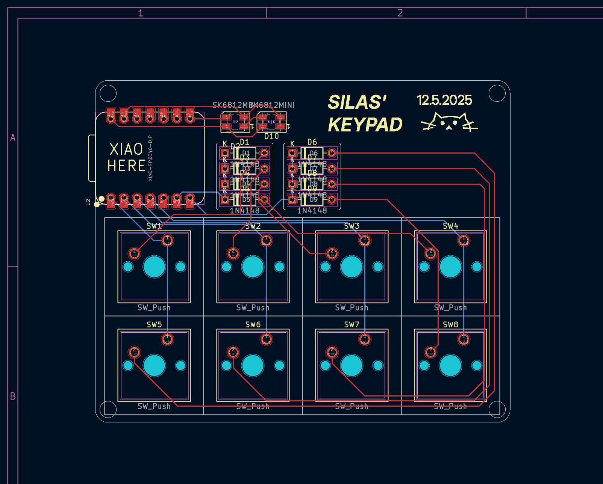
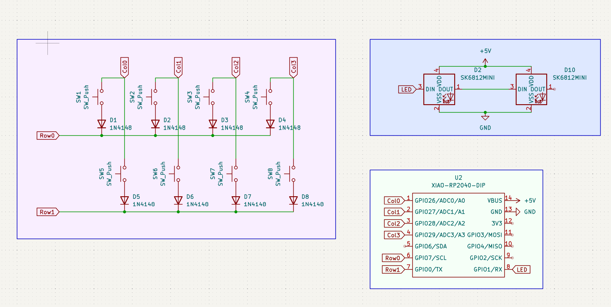
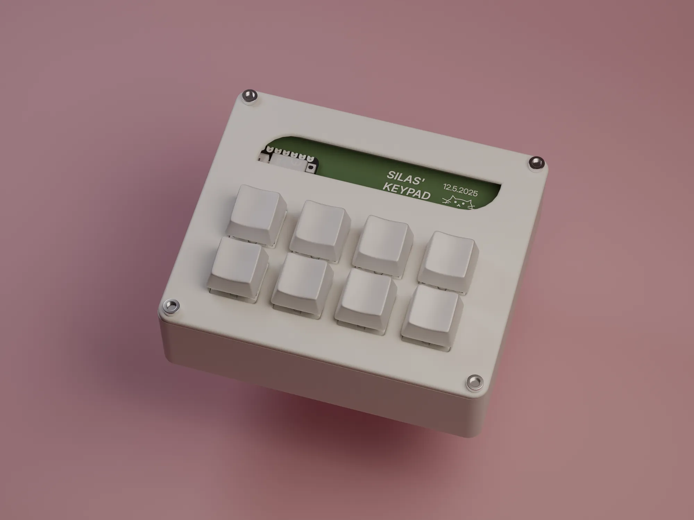

# SILAS' KEYPAD
Silas' hackpad project created with help from Hackclub! This macropad has eight keys that are currently programmed to control browser and copy/paste functions, but can be programmed with other keys and even macros. The pad runs on an RP2040 devboard by Seeed Studio. The PCBs were created in KICAD and the CAD files were made in Fusion. I used the KMK library to program my keyboard.

I created this macropad to gain experience in electronics while making something cool that I will actually use. Currently, the keys are as follows from left to right: Row 1: Copy, Paste, Cut, Ctrl-Alt-Del; Row 2: New Tab, Close Tab, Reopen Closed Tab, and new firefox window (requires custom shortcut on windows).

## Bill of Materials
- **8x** M3x5mx4mm heatset inserts
- **8x** M3x16mm screws
- **2x** SK6812 MINI-E LEDs
- **8x** Cherry MX Switches (Or equivilant)
- **8x** Blank DSA keycaps
- **8x** Through-hole 1N4148 Diodes
- **1x** 3d Printed Case (Self Printing)
- **1x** Manufactured PCB
- **1x** Seeed XIAO RP2040
## Cad
All cad was created in Fusion 360 Education. I really enjoyed using bevels on the edges to make it feel truely polished. All holes in the base will be fitted with threaded inserts and the holes will use M3 nuts and bolts.

 
## PCB
PCBs were created in KICAD.

 

## Renders
Renders were created in Fusion and Blender.

